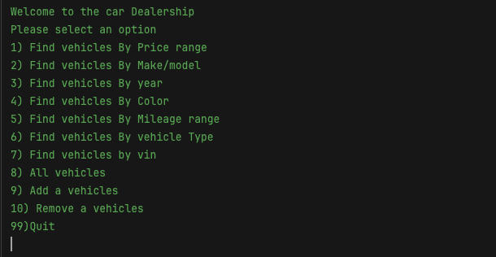
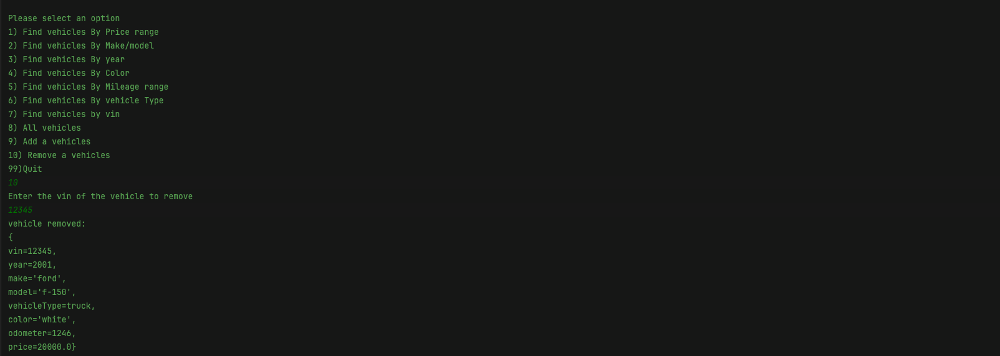
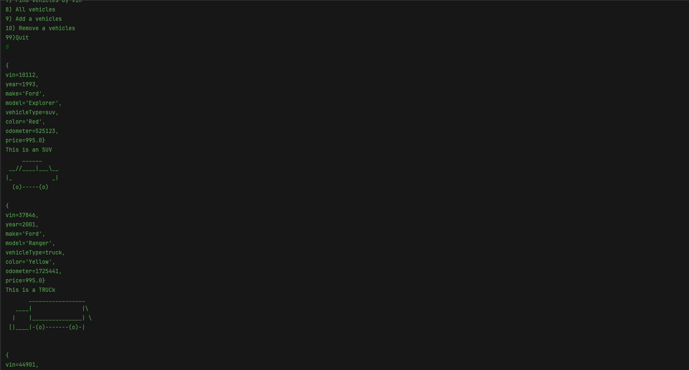
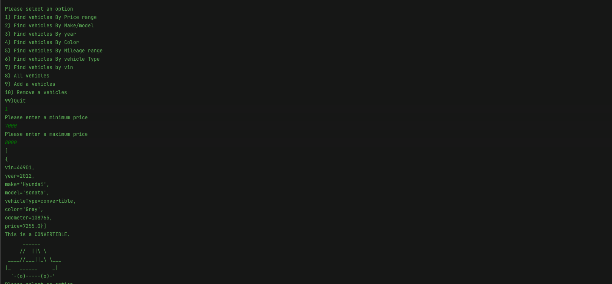
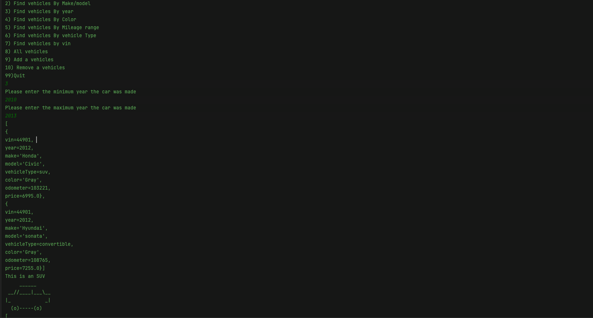
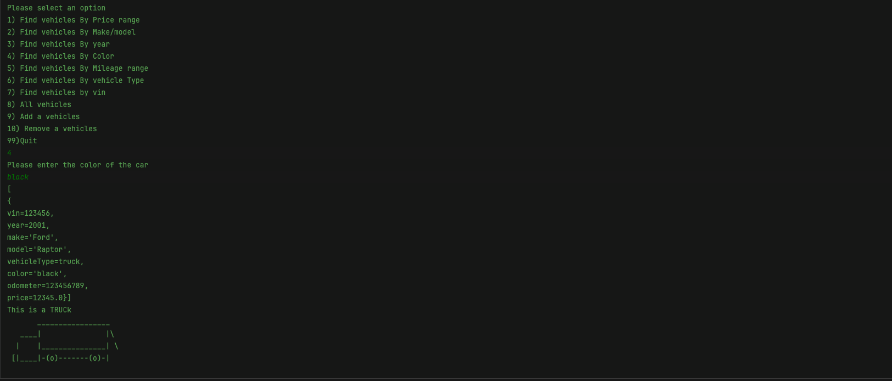

# A Car Dealership

## Description
The Car Dealership Management System is a console-based Java application that allows users to manage a dealership's vehicle inventory. This includes adding, removing, and viewing vehicles, as well as searching for vehicles based on criteria like price range, make/model, year, color, mileage, vehicle type, and VIN. The project is designed to provide a user-friendly interface for dealership employees to manage inventory efficiently, utilizing object-oriented principles and Java enums for enhanced organization.

## Table of Contents

- [Usage](#usage)
    - [Screenshot](#screenshot)
- [Features](#features)
- [How It Works](#How-It-Works)
- [Prerequisites](#prerequisites)
- [License](#license)

------------------

## Usage
To use this application:

1. Clone or download the project to your local machine.
2. Compile and run the main program using your IDE (e.g., IntelliJ IDEA).
3. Follow the on-screen menu prompts to navigate through the application's features, including adding, removing, and searching for vehicles in the dealership inventory.
## Screenshot

## Home Screen

## Adding Vehicle

## Removing Vehicle

## All vehicles

## Vehicles by Price

## Vehicles by Make/Model

## Vehicles by Year

## Vehicles by Color

## Vehicles by Mileage

## Vehicles by Vehicle Type

## Vehicles by VIN

## Inventory.csv

------------------

## Features
<ul>
<li>Add a Vehicle: Allows users to add a new vehicle to the dealership inventory by entering details such as VIN, make, model, year, vehicle type, color, mileage, and price.
<li>Remove a Vehicle: Users can remove a vehicle from the inventory by entering the VIN.
<li> View All Vehicles: Displays a list of all vehicles in the dealership’s inventory.
<li> Search Vehicles by Various Criteria:
  <ul> 
<li>Price Range </li>
<li>Make/Model </li>
<li>Year Range </li>
<li>Color </li>
<li>Mileage Range </li>
<li>Vehicle Type (Car, Truck, SUV, Convertible)</li>
<li>VIN </li>
  </ul>
<li> Vehicle Type Descriptions: Each vehicle type has a unique ASCII art display and description, shown when adding a vehicle or viewing details in the inventory.

</ul>

## How It Works
1. Initialization: The application loads an initial inventory from a CSV file using DealershipFileManager. This inventory can then be modified during the session.
2. User Interaction: A menu-driven interface allows users to interact with the system. The user selects options from the menu, and the system performs the corresponding actions.
3. File Management: Inventory data can be loaded from and saved to a CSV file, ensuring data persistence between sessions.
4. Vehicle Management:
<ul>
<ul>
  <li>Vehicles are stored in an ArrayList within the Dealership class.</li>
  <li>Vehicle information, including type, is handled using an enum (VehicleType), which provides ASCII art and descriptions.

</ul>
</ul>

------------------

## Prerequisites
<ul>
<li> Before running the Account Ledger CLI Application, ensure you have the following:
<ul>
<li>Java Development Kit (JDK) installed on your machine.</li>
<li>A command-line interface (CLI) to run the program.</li>
<li> A text editor or IDE (optional) to modify or view the source code.</li>
<li>The transactions.csv file in the project directory, or it will be created upon the first transaction.</li>
</ul>
</ul>

--------------------

## License
MIT License
